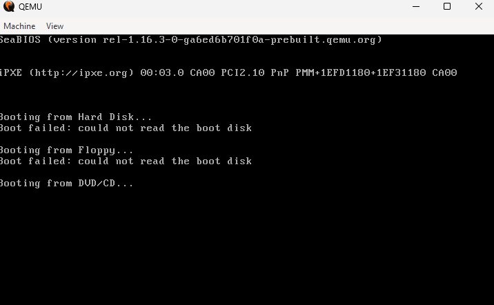
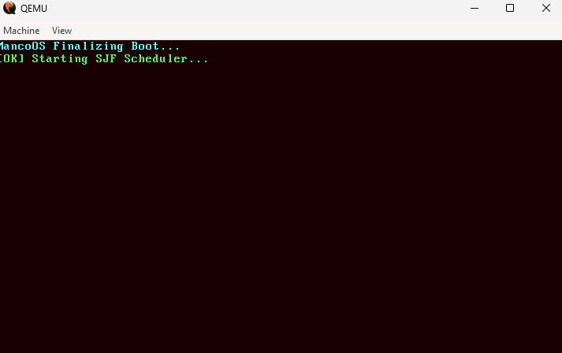
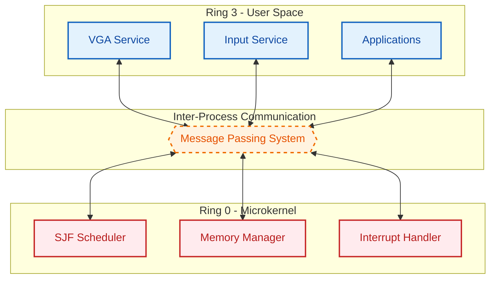

# MancoOS - Educational Microkernel


**MancoOS** is a microkernel-based operating system designed for educational purposes. Built from scratch using **C++17** and **x86 Assembly**, it emphasizes modularity, memory isolation, and a robust inter-process communication (IPC) system.

---

## System Evidence

| **IDT & Boot Sequence** | **SJF Scheduler Initialization** |
|:------------------------:|:---------------------------------:|
|  |  |
| *Kernel successfully loading the Interrupt Descriptor Table.* | *The SJF algorithm starting to manage system tasks.* |

---

## Architecture

Following the **Minix philosophy**, MancoOS keeps the Ring 0 (Kernel Space) as minimal as possible. Services such as video drivers and input handlers run in Ring 3 (User Space), communicating via a message-passing bus.



---

## Key Technical Features

- **SJF Scheduler**: Implements the Shortest Job First algorithm to minimize average waiting time, featuring assembly-level context switching.
- **Physical Memory Manager (PMM)**: A high-performance memory allocator using a Bitmap structure to manage 4KB pages.
- **Custom Visual Identity**: A unique VGA color palette based on Rich Mahogany and Coffee Bean codes.
- **Robust Exception Handling**: Custom ISRs and IDT configuration to ensure system stability and prevent triple faults.
- **Containerized Build System**: A fully automated Docker pipeline for cross-compiling i386-elf binaries.

---

## How to Run

### 1. Build the ISO (Docker)

Ensure you have Docker installed and run the following command to generate the bootable image:

```powershell
docker run --rm -v ${PWD}:/root/env microkernel-builder make iso
```

### 2. Execute via QEMU

You can run the OS locally or through a browser-based VNC container:

```powershell
docker run -it --rm -p 8006:8006 -v ${PWD}:/storage -e BOOT="file:///storage/microkernel.iso" -e KVM=N qemux/qemu
```

Access the system at `http://localhost:8006`.

---

## Author

Developed by **PedroVFSantos** - Computer Science Student at UFSCar.
