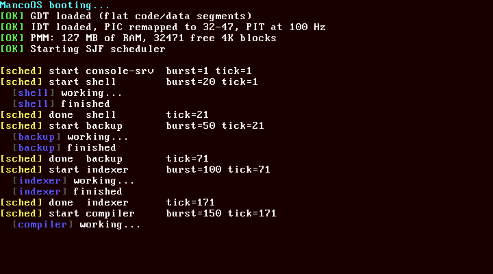
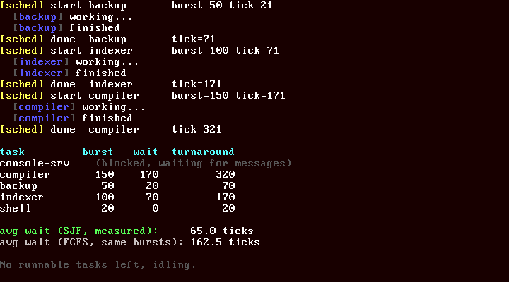

# MancoOS

A small x86 (32-bit) kernel I wrote to learn how the pieces of an OS fit together: boot, segmentation, interrupts, physical memory, context switching and message passing. It's written in C++17 with a bit of assembly, boots via Multiboot (GRUB or QEMU's `-kernel`), and runs a Shortest Job First scheduler over a handful of demo tasks.

The long-term idea is a Minix-style microkernel, where drivers live outside the kernel and talk over IPC. **It isn't there yet**: everything still runs in ring 0 and shares one address space. The IPC and the "console server" are already shaped like that, so moving them to ring 3 is the next step (see [What's missing](#whats-missing)).

<p>
  
  
</p>

## What it does

On boot the kernel:

1. Sets up a flat GDT (code + data segments, 0 to 4GB).
2. Loads an IDT with stubs for the 32 CPU exceptions and the 16 PIC IRQs, remaps the PIC to vectors 32-47, and sets the PIT to 100 Hz. Any CPU exception prints its name, `eip` and error code, then halts.
3. Reads the RAM size from the Multiboot info and starts a bitmap allocator for 4KB pages. Everything below the end of the kernel image is marked as used.
4. Creates five tasks. Each one gets a stack page from the PMM.
5. Runs the scheduler until there's nothing left to run, then prints a table with waiting and turnaround times.

### Scheduler

It's **non-preemptive SJF**. Each task has an estimated burst (in timer ticks). The scheduler always picks the `READY` task with the smallest estimate, and that task keeps the CPU until it finishes, blocks on `receive`, or calls `yield`. The timer doesn't preempt anything; it's only there to measure time.

The scheduler loop runs on `kernel_main`'s stack, like xv6's `scheduler()`. Switching is always task → scheduler → task through `switch_task` (`src/switch.s`), which saves only the callee-saved registers (`ebx`, `esi`, `edi`, `ebp`) and swaps `esp`. To start a new task, `add_task` builds a fake frame on its stack that looks like a `switch_task` call that never returned, so the first switch "returns" into `task_entry`.

The demo tasks arrive in the order `compiler (150)`, `backup (50)`, `indexer (100)`, `shell (20)`, and SJF runs them shortest first:

```
[sched] start console-srv  burst=1 tick=1
[sched] start shell        burst=20 tick=1
  [shell] working...
  [shell] finished
[sched] done  shell        tick=21
[sched] start backup       burst=50 tick=21
...
task         burst   wait  turnaround
console-srv    (blocked, waiting for messages)
compiler       150    170         320
backup          50     20          70
indexer        100     70         170
shell           20      0          20

avg wait (SJF, measured):     65.0 ticks
avg wait (FCFS, same bursts): 162.5 ticks
```

The FCFS line is computed from the same bursts in arrival order, just for comparison.

### IPC

Each task has a mailbox of 8 messages (`src/ipc.cpp`). `send` puts a message in the destination's mailbox and wakes it if it was blocked. `receive` takes the first message that matches (from a given sender or `IPC::ANY`), or blocks the task until one arrives.

`send` is also a scheduling point: after sending, the sender yields. So if the receiver has a shorter burst, it runs right away. That's why the workers' lines show up in order even though only `console-srv` writes to the screen.

## Building and running

You need `g++` with 32-bit support (`gcc-multilib`/`lib32-gcc-libs`), `nasm`, `ld` and `qemu-system-i386`. The ISO also needs `grub-mkrescue` and `xorriso`.

```sh
make run        # builds kernel.bin and boots it with qemu -kernel
make run-iso    # same thing through GRUB
```

Kernel output also goes to COM1, so with `make run` it shows up in the terminal as well.

If you don't want to install the toolchain, there's a Dockerfile:

```sh
./build_docker.sh                          # builds the image (first run) and microkernel.iso
qemu-system-i386 -cdrom microkernel.iso
```

Without QEMU installed (or without a spare screen), the `qemux/qemu` container shows the VM in the browser at `http://localhost:8006`. It attaches the ISO as a USB drive, which SeaBIOS skips, so the kernel is passed straight to QEMU with `-kernel`:

```sh
docker run -it --rm -p 8006:8006 \
    -v "$PWD/microkernel.iso":/boot.iso -v "$PWD/kernel.bin":/kernel.bin \
    -e KVM=N -e ARGUMENTS="-kernel /kernel.bin" qemux/qemu
```

(On PowerShell, swap `$PWD` for `${PWD}` and the `\` for a backtick.)

## Layout

```
src/boot.s          multiboot header, stack, jump to kernel_main
src/kernel.cpp      init order and panic()
src/gdt.cpp         GDT (+ gdt_flush.s)
src/idt.cpp         IDT
src/interrupts.s    lidt, ISR/IRQ stubs, common handler
src/isr.cpp         exception handler, PIC, PIT
src/pmm.cpp         bitmap page allocator
src/scheduler.cpp   SJF, tasks, stats
src/switch.s        context switch
src/ipc.cpp         mailboxes, send/receive
src/user_task.cpp   demo tasks (console server + workers)
src/console.cpp     VGA text mode, serial, custom palette
src/string.cpp      memset/memcpy/memmove (GCC may emit calls to them)
```

## What's missing

- **User mode.** No TSS, no ring 3 segments, no syscalls. The tasks are kernel threads.
- **Paging.** The PMM hands out physical pages, but there's no virtual memory yet, so there's no isolation between tasks.
- **Preemption.** Being non-preemptive is on purpose, since it's the classic SJF, but a task stuck in a loop freezes the system. A preemptive variant (SRTF) would use IRQ0 to switch.
- **Real burst estimates.** Right now the burst is passed in by hand. Textbook SJF estimates it with exponential averaging of past bursts.
- Keyboard driver, filesystem, and using the `SYS_READ_KBD`/`FS_OPEN` message types that already exist in `ipc.hpp`.

## License

MIT. Pedro V. F. Santos, Computer Science student at UFSCar.
